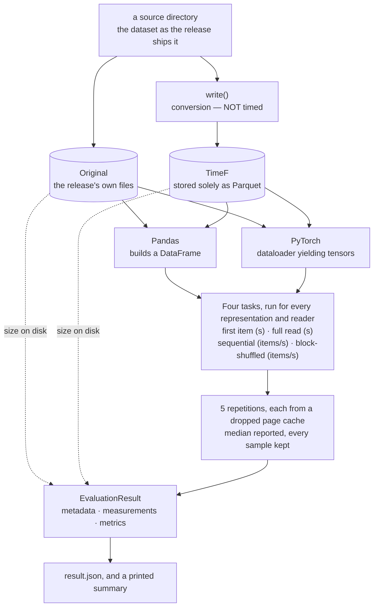

# TimeNet-Evaluations


TimeNet-Evaluations measures what a storage format costs to read. For each dataset you give it, it
holds two representations — the files as the release ships them, and the same data converted to
TimeF — and reads both with both Pandas and PyTorch, over four access patterns. It records what each
representation takes on disk and how long each read takes.

It is a benchmark harness, not a library. It answers one question — is TimeF faster to read **into
the tool you already use** than the original files are, on this machine — and stops there.

## The evaluation pipeline

Two representations, two readers, four tasks. The point of the grid is that **each reader reads both
representations**: holding the reader fixed and changing only the representation is what isolates
the format's contribution. A cell measures reading *into the form the workload will actually hold* —
a pandas `DataFrame`, or tensors from a PyTorch dataloader — not just moving bytes off disk.



Read it top to bottom: one directory in, two representations, four cells, one record out. Conversion
is wrapped by `write()` and is deliberately **not** timed — it exists so TimeF has an artifact whose
size can be measured. The original is never written here at all; its size is taken from the
release's own files as they are.

| Part | What it does |
| --- | --- |
| the source | Read into memory so `write()` can convert it. The only part that knows the dataset |
| the representations | `Original` as the release ships it, read through its own reference loader where one exists; `TimeF` converted and stored as Parquet |
| the readers | Pandas and PyTorch, each reading both representations into its own in-memory form |
| the harness | Drops the page cache, runs each task five times, reduces to a median, and measures size |
| the result and report | Carries the whole run in one object — metadata, measurements, derived metrics — writes it as JSON, and prints a summary |

A rate in items per second counts a **canonical item** fixed per dataset in advance, so both rows
count the same unit and a representation storing a coarser one pays to cut it. Rates therefore do
not compare across datasets.

Figures are medians rather than means: one thermal excursion or one slow page fault moves a mean and
does not move a median. Every repetition starts from a dropped page cache, so what is reported is
first-touch cost — the situation a storage format is actually chosen for. There is no warm-up; the
warm steady-state figure is reachable with `--warmup`, and is deliberately not the number the table
carries.

## Install

Requires Python 3.12 or 3.13 — `pyhealth` sets that range. This is a
[uv](https://docs.astral.sh/uv/) workspace with one package, `timenet-evaluations`, under
`packages/`.

```bash
cd TimeNet-Evaluations   # the unpacked archive
make sync-ci        # install every dependency group; needs no credential
make install-hooks  # set up pre-commit hooks (run once per clone)
```

That is the whole setup for working on the harness, and it is the environment CI builds: lint, type
checking, the test suite and the licence gate all run against it. What it leaves out is `timef`, the
extra carrying `timenet` — the format under test — so the two TimeF round-trip tests skip, 2 of the
18, and the benchmark itself cannot run.

### The `timef` extra

`timenet` is an optional extra rather than an ordinary dependency because it resolves from a pinned
git revision of `OpenTSLM/TimeNet`, which is private; this repository does not build it. The pin is
the point — a benchmark whose subject moves under it is not reproducible. Installing the extra needs
read access to that repository:

```bash
gh auth login          # once per machine
make configure-source  # report which credential will be used; fails if there is none
make sync              # install every dependency group and the timef extra
```

`make configure-source` writes nothing to disk: the credential reaches git per command, for the
length of that command only. On a machine with no GitHub CLI, copy `.env.example` to `.env` and set
`TIMENET_SOURCE_TOKEN` to a GitHub token with `Contents: read` on the source repository. `.env` is
gitignored and must never be committed.

`make lock` regenerates `uv.lock` and needs the same credential, because locking has to resolve the
git source in order to record it. CI never locks; it syncs from the committed lock.

## Run the benchmark

The `timef` extra is required. Without it the run raises `EvaluationError` and stops before it loads
anything, rather than measuring the half of the grid that remains: a comparison missing its own
subject is not a comparison. The benchmark never runs in CI either — timings from two machines are not
comparable, so a green CI run says nothing about a measurement.

```bash
uv run timenet-evaluations <source-dir> --out results
uv run python -m timenet_evaluations <source-dir> --out results
```

Either entry point works; they are the same `main`. `<source-dir>` is the directory holding the
dataset you are measuring, as the release ships it — the `Original` representation — and it is the
only required argument. A dataset needs a loader before it can be measured; one ships today, and
adding another is writing a loader, never touching a reader. Every flag has a default, so the
command above is a complete run.

| Flag | Default | What it sets |
| --- | --- | --- |
| `--out` | `results` | Directory the run's own directory is created beneath |
| `--repeats` | `5` | Recorded repetitions per cell; the median is taken over these, and every sample is kept |
| `--warmup` | off | Read once after the cache drop before recording, giving a warm figure instead of a cold one |
| `--block-bytes` | `67108864` | Bytes one block spans, 64 MiB. B is derived from it per representation |
| `--seed` | `0` | Seeds the block shuffle, so two runs walk the blocks in the same order |

`--repeats` below one raises rather than producing a median over nothing. `--warmup` decides which
question the run answers, so the result records it, and a report combining runs that disagree on it
refuses: a warm figure and a cold one are both well formed and differ by several times.
`--block-bytes` and `--seed` belong to the block-shuffled read and are recorded too, because a rate
is not reproducible without the plan that produced it.

Each run writes `results/<run_id>/result.json` and prints a summary. Runs accumulate rather than
overwrite, so two runs can be diffed field by field.

## Development

This project uses uv for environment and dependency management,
[ruff](https://docs.astral.sh/ruff/) for linting and formatting, and
[ty](https://github.com/astral-sh/ty) for type checking.

### Make targets

Every routine task has exactly one name, and that name is a make target. These are all of them:

```bash
make sync              # install every group and the timef extra (uv sync --all-groups --all-extras)
make sync-ci           # install every group and no extra (uv sync --all-groups); no credential
make lock              # regenerate uv.lock (uv lock); needs the credential
make configure-source  # report which credential the private source will be fetched with
make check             # format + lint + typecheck (ruff format, ruff check, ty check)
make lint-fix          # auto-fix lint findings with ruff
make test              # the test suite in the dev environment
make license-check     # fail on a copyleft or undeclared-licence dependency
make build             # build every workspace member as its own distribution
make install-hooks     # install pre-commit hooks (run once per clone)
make clean             # remove .venv, the tool caches, and Python bytecode
```

### Verification

Run these before opening a pull request, and make them pass:

- `make check` — `ruff format`, `ruff check`, `ty check`
- `make lint-fix` — auto-fix the lint findings ruff can fix
- `make test` — the test suite in the dev environment
- `make license-check` — fails on a copyleft or undeclared-licence dependency
- `uv run pre-commit run --all-files` — every hook, over every file in the tree
- `UV_PYTHON=3.12 make sync-ci && UV_PYTHON=3.12 make test` — the suite on the minimum supported Python

Every gate CI enforces is in that list: the hooks, the licence check, and the test suite on both
supported interpreters. `make check` and `make lint-fix` are local — CI reaches ruff and ty
through the hooks instead.

`uv run pre-commit run --all-files` runs every hook over every file in the tree. CI runs the same
hooks scoped to the pull request's commit range
(`pre-commit run --from-ref origin/<base> --to-ref <sha>`). The local run is therefore the wider
check, not a mirror of CI: it can fail on a file your change never touched, and a green CI run is not
proof that the whole tree is clean.

Don't bypass hooks with `--no-verify`; if one fails, run `make check` / `make lint-fix` and commit
again.

## License

TimeNet-Evaluations is released under the [MIT License](LICENSE).

### Dataset licenses

The MIT License covers this repository's own code, not the data it measures. Every dataset you feed in
keeps its own upstream license, and some sources — sleep-EDF among them — grant access only to
credentialed users. Check the terms where you obtain the data and follow them.
